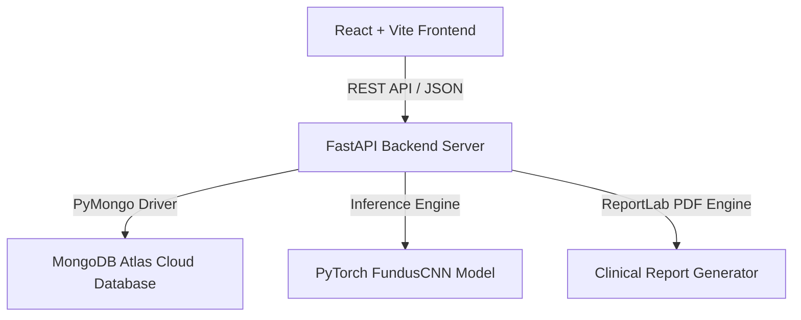

# VisionAssistant AI: Deep Learning Myopia Screening & Clinical Decision Support System
### Final Year Capstone Project / Academic Research Project

VisionAssistant AI is a web-based clinical decision support application designed as a student research project to assist eye care practitioners in screening and evaluating myopia progression risk. The project combines a Deep Learning Convolutional Neural Network (CNN) for fundus scan analysis with clinical optical biometry calculations.

---

## 🏗️ Project Architecture

The system is developed as a split full-stack application using the following components:



*   **Frontend Client:** React 18, Vite, Vanilla CSS styling rules, Framer Motion transitions, and Chart.js dashboards.
*   **Backend Server:** FastAPI (Python 3.10+), PyTorch (for model inference), running on an in-memory Uvicorn local host.
*   **Database Store:** MongoDB Atlas (Cloud NoSQL database).
*   **Deep Learning Pipeline:** `FundusCNN` (A PyTorch Convolutional Neural Network that accepts 224x224 retina scans, processes them through sequential Conv2d layers and MaxPool2d pooling, and projects Grad-CAM attention heatmaps highlighting region classifications).

---

## 🔒 Implemented Security Features

For safe data handling and session management, the following security features are integrated:

1.  **Password Encryption (Bcrypt):** Users' passwords are encrypted using Bcrypt salt rounds before they are stored in the MongoDB database.
2.  **JWT Authentication & Revocation:** Access to clinical features is restricted using JSON Web Tokens (JWT). Logging out revokes the token by adding it to a database blacklist.
3.  **Payload Input Sanitization:** Global request middleware automatically filters incoming API body content:
    *   **XSS Protection:** Converts HTML special characters to text entities to prevent script injection.
    *   **NoSQL Filter:** Removes fields starting with `$` to prevent query injection attacks.
4.  **API Rate Limiting:** Restricts API requests to **150 requests per 15 minutes** per client IP address to prevent request spamming.
5.  **OTP Verification Expiry:** Implements a strict **10-minute validity window** on generated OTP codes for signup verification and password resets.
6.  **Uncaught Error Boundary Sanitization:** Restricts server exception outputs to sanitized JSON responses to prevent database stack traces from leaking to client logs.
7.  **Audit Trail Logging:** Logs key authentication and clinical events inside an `audit_logs` collection with UTC timestamps.

---

## 🚀 Setup & Execution Guide

### Prerequisites
*   Node.js (v18+)
*   Python (v3.10+)
*   MongoDB Atlas Account

### 1. Run Backend Server
1.  Open your terminal in the backend directory:
    ```bash
    cd backend
    ```
2.  Set up your Python virtual environment:
    ```bash
    python -m venv venv
    venv\Scripts\activate
    ```
3.  Install the required packages:
    ```bash
    pip install -r requirements.txt
    ```
4.  Create a `.env` file in the `backend/` directory:
    ```env
    MONGODB_URI=your_mongodb_atlas_uri
    JWT_SECRET_KEY=your_jwt_secret_key
    ```
5.  Start the FastAPI backend:
    ```bash
    uvicorn main:app --reload
    ```

### 2. Run Frontend Server
1.  Open a second terminal in the frontend directory:
    ```bash
    cd Frontend
    ```
2.  Install dependencies:
    ```bash
    npm install
    ```
3.  Start the development server:
    ```bash
    npm run dev
    ```
4.  Click the local link printed in the terminal (e.g. `http://localhost:5173`) to view the application in your browser.

---

## 📊 Core Project Features

*   **Clinical Lifestyle Auto-Fill:** pre-populates doctor clinical evaluation forms with selected patient parameters.
*   **Retinal Grad-CAM Cam overlays:** highlights classified morphological regions.
*   **PDF Clinical Report Downloads:** exports diagnostic records containing patient profiles, biometry inputs, and recommendations.
*   **Security Auditing Panel:** displays the active status of Bcrypt, JWT, and input filters on user profiles.

---
*Developed as a student research study project. For educational and diagnostic support demonstration only.*
