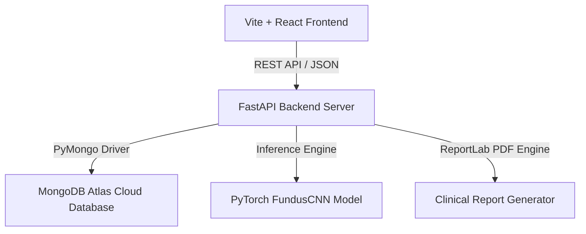

# VisionAssistant AI: Deep Learning Myopia Screening & Clinical Decision Support System

VisionAssistant AI is an enterprise-grade medical support application designed to assist ophthalmologists in routine screening, tracking, and diagnosing myopia risk using a hybrid pipeline of Deep Learning (Convolutional Neural Networks) and Clinical Optical Biometry analysis.

---

## 🏗️ System Architecture

The application is structured as a decoupled full-stack architecture built to MNC industry standards:



*   **Frontend:** React 18, Vite, TailwindCSS (Vanilla CSS theme rules), Framer Motion (micro-animations), Lucide Icons, and Chart.js.
*   **Backend:** FastAPI (Python 3.10+), PyTorch (Inference model evaluation), Uvicorn server.
*   **Database:** MongoDB Atlas (Cloud NoSQL Database).
*   **Model Pipeline:** `FundusCNN` (PyTorch architecture processing 224x224 retina scans, extracting features via Conv2D blocks, downsampling via MaxPool2D, and rendering diagnostic Grad-CAM heatmaps).

---

## 🔒 MNC-Grade Security Implementations

To ensure patient privacy, prevent data leaks, and comply with standard medical software protocols (HIPAA-ready), the system integrates the following security features:

1.  **Password Cryptography (Bcrypt):** All user credentials undergo SHA-256 pre-hashing (bypassing Bcrypt's native 72-byte limit) and are salted/hashed prior to database write.
2.  **JWT Guards & Token Blacklisting:** Sensitive clinical routes are guarded. Upon logout, active tokens are blacklisted in MongoDB and immediately revoked to prevent session replay attacks.
3.  **Global Input Sanitization Middleware:** A custom request-pipeline interceptor automatically scans all incoming JSON payloads:
    *   **XSS Mitigation:** Escapes HTML special characters in string inputs.
    *   **NoSQL Injection Block:** Automatically drops incoming query keys starting with `$` to prevent MongoDB operator manipulation.
4.  **API Rate Limiting:** Dynamic rate limiter restricts incoming connections to a maximum of **150 requests per 15 minutes per IP address** to block bot attacks (loopback bypass enabled for local developer convenience).
5.  **Temporal OTP Code Expiry:** Generates a secure random 6-digit verification code with a strict **10-minute expiration constraint** for password resets and signup validation.
6.  **Uncaught Error Boundary Sanitization:** Global FastAPI exception handlers catch uncaught exceptions, log detailed tracebacks to the server console, and return a sanitized, non-verbose JSON error to clients to prevent system/database structure leaks.
7.  **Action Audit Logging:** Record clinical actions (e.g. logouts, logins, diagnostic outputs) inside the `audit_logs` collection with timezone-aware UTC timestamps.

---

## 🚀 Installation & Running Locally

### Prerequisites
*   Node.js (v18+)
*   Python (v3.10+)
*   MongoDB Atlas Account (URI configured)

### 1. Setup Backend
1.  Navigate to the backend folder:
    ```bash
    cd backend
    ```
2.  Create a virtual environment:
    ```bash
    python -m venv venv
    venv\Scripts\activate
    ```
3.  Install dependencies:
    ```bash
    pip install -r requirements.txt
    ```
4.  Configure your environment variables (`backend/.env`):
    ```env
    MONGODB_URI=your_mongodb_atlas_connection_string
    JWT_SECRET_KEY=your_secret_key
    ```
5.  Launch the FastAPI server:
    ```bash
    uvicorn main:app --reload
    ```

### 2. Setup Frontend
1.  Navigate to the frontend folder:
    ```bash
    cd Frontend
    ```
2.  Install packages:
    ```bash
    npm install
    ```
3.  Launch the Vite development server:
    ```bash
    npm run dev
    ```
4.  Open `http://localhost:5173` in your browser.

---

## 📊 Core Application Features

*   **Clinical Auto-Fill:** Doctor forms automatically capture patient lifestyle data (Screen Time, Reading Time, Outdoor Time, Sleep) upon patient selection in the dashboard.
*   **Grad-CAM Highlight Overlay:** Real-time retinal scan heatmaps highlight morphological risk areas.
*   **Interactive PDF Report Exports:** Generating professional, clinic-ready diagnostic PDF summaries containing client metadata, biometry details, and lifestyle factors with a single click.
*   **Security Auditing Panel:** Real-time security statuses displayed directly on patient and doctor profiles.

---
*For investigational and diagnostic support purposes only.*
